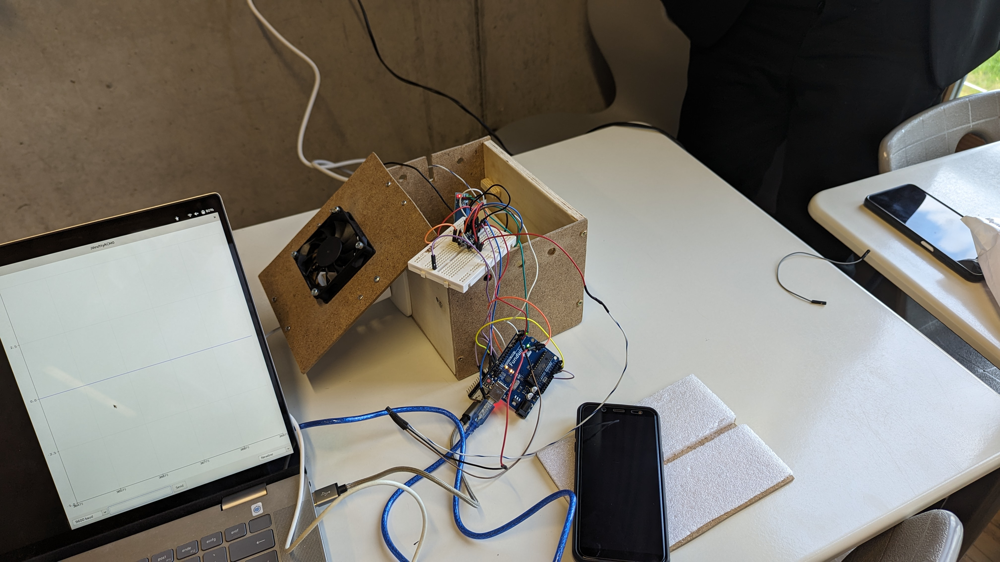

# ILS3000 



Das Intelligente Lade-System (3000) überwacht ihr Mobiltelefon beim Ladevorgang. Das Problem besteht darin, dass ^, vor allem Lithium-Ionen Varianten, nie voll geladen werden sollten. Eine hohe Ladung kann der Batterie schaden. Dadurch leidet die Kapazität, kann allerdings auch z. B. einen Akku Brand verursachen, welcher sehr schwer zu löschen ist.

### Funktionsweise
Unser zu ladendes Gerät wird via einer extra dafür entwickelten App mit der Steuereinheit des ILS 3000 verbunden. Die Kommunikation findet dabei über ein selbstentwickeltes, extra spezifiziertes Bluetooth LE Protokoll statt. 
In der Demo App gibt es Insgesamt drei verstellbare Werte:
- Maximaler Batterie Lade Stand
- Minimaler Batterie Lade Stand
- Demo Batterie

1 und 2 regeln die wichtigsten Funktionen.
Beim Aufladevorgang wird der momentane Ladestand in echtzeit übertragen. Sollte der Maximale Ladestand erreicht sein, wird per Relais die Steckdose deaktiviert. Damit wird der Ladevorgang unterbrochen. Liegt das Handy jetzt allerdings ungenutzt rum, verliert es auch langsam an Akku. Denn beispielsweise Systeme wie die Mobilfunk Netzwerk verbindung muss aktiv aufrecht erhalten werden, um nach neuen Nachrichten oder Anrufen ausschau zu halten und dementsprechend zu reagieren. Das ist allerdings nur einer der vielen Faktoren, welche zu einem Akku verbrauch im Ruhe Modus beitragen. 
Sollte nun irgendwann der Minimale Batterie Stand erreicht werden, wird automatisch die Steckdose wieder aktiviert, und die Prozedur beginnt von vorne (Handy lädt bis zum eingestellten Maximalen Batterie Stand).
Folgende Logik steuert das Aktivieren von besagter Steckdose.
```c 
if (current_charge >= max_charge && is_charging == true) {
  gpio_set_level(CHARGING_PORT, 0); // Deaktiviert die Steckdose
  is_charging = false;
} else if (current_charge < min_charge && is_charging == false) {
  gpio_set_level(CHARGING_PORT, 1); // Aktiviert die Steckdose
  is_charging = true;
}
```


Die Demo Batterie ist für Vorführungszwecke eine falsche Batterie. Dort kann man der Steuereinheit "falsche" Batterie-Stände schicken, um eine der gewünschte Handlung vorzuführen. 


Zudem wird die Batterie auch warm, vor allem wenn man lange lädt. Deswegen ist die Box mit einem Temperatur Sensor ausgestattet. Der Temperatursensor mittelt die Werte von 10 Messungen. Die Umrechnung von der Spannung eines TMP36GZ wird dabei in Grad Celsius umgerechnet. Die Formel dafür ist 90 - ( Gemessene Spannung / 50 ). Sollte die gemittelte Temperatur den voreingestellten Wert von 30C, wird ein Lüfter aktiviert. Dies findet ebenfalls über ein Relay statt.

### Relais ansteuerung
Die Ansteuerung der Relais hat sich als herausforderung gestaltet. Die Steuereinheit, welche auf einem ESP32 laeuft, bekommt nicht genug spannung auf, um die Relais zu schalten. Deswegen wurde ein zweiter Arduino (Fundoino Uno) eingebaut. Dieser misst auf den Eingang Ports A0 und A1, ob die Signale von der Steuereinheit einkommen. Ist dies der Fall, wird Automatisch ein voreingestellter Port (2 bzw. 4) mit Spannung versorgt. Das ist ein wichtiger Schritt, da der ESP32 die Ports lediglich mit 3.3V versorgen kann. Der Fundoino UNO schafft hingegen 5V. Das entspricht der benötigten Spannung, um die Relais zu steuern.

Folgendes Programm steuert den "Leveler" Arduino
```c
int stateA0 = analogRead(A0);

int stateA1 = analogRead(A1);

if(stateA0 > 100) {
   digitalWrite(2, HIGH);
} else {
   digitalWrite(2, LOW);
}
if(stateA1 > 100) {
   digitalWrite(4, HIGH);
} else {
   digitalWrite(4, LOW);
}
delay(10);
```


### Zusammenbau
Benötigte Gegenstände:
Arduino, Ladekabel, Ventilator, Steckdose, Relais, Drähte, Handynetzteil, Temperatursensor, Adapter, Dreifachsteckdose
Der Zusammenbau erfolgte zunächst durch die Fertigung einer Box. Im Anschluss wurden an den Seiten zwei Bohrungen vorgenommen, in welche die Steckdose sowie eine Dreifachsteckdose eingesetzt und befestigt wurden. Eine Steckdose wurde via Relai mit einer weiteren Steckdose verbunden, somit hat man eine Steckdose, welche man mit einem Relais schalten kann. Der Lüfter wurde mit demselben Prinzip angeschlossen, nur dass dieser mit einem Netzteil an die Mehrfachsteckdose angesteckt wurde. Im Anschluss wurden an den Seiten einige Bohrungen vorgenommen, welche die Abfuhr der heißen Luft vom Mobiltelefon gewährleisten, welche mit dem Lüfter versucht werden soll, abzutransportieren.


